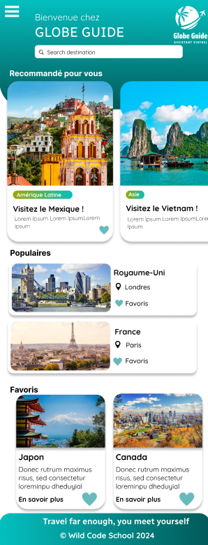
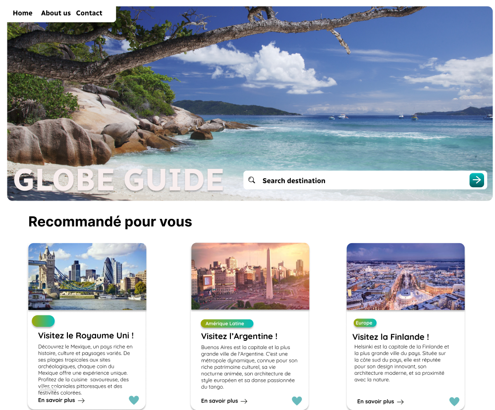
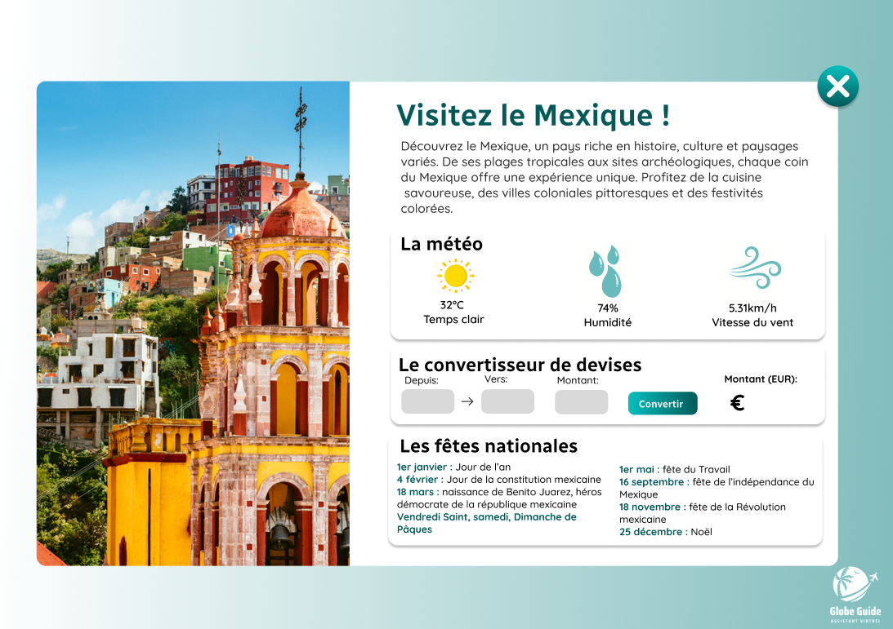

<h1 align="center">🌍 Welcome to Globe Guide, your ultimate virtual travel assistant ! 🌍 </h1>
<p align="center">

</p>
<br>

# 📄 About :

With Globe Guide, you can explore over 100 countries around the world with ease. Our platform integrates various APIs to provide you with comprehensive information on exchange rates, weather forecasts, and holidays, ensuring that you have all the necessary details to plan your perfect trip.
<br>

<p align="center"> ✈️ "Travel far enough, you meet yourself" so buckle up and travel with the Globe Guide community ! ✈️ </p>

# 🏞️ Discover the website :

[globe-guide.netlify.app/](https://globe-guide.netlify.app/)

# 🎨 Design (mock-ups):

<div align="center">
<h2> Phone </h2>

</div>

<div align="center">
<h2> Desktop </h2>

<p></p>

</div>

# 💻 Tech Stack:

       

## 👨‍🔧 Install

```sh
npm install
```

#🔌APIs utilisées:

- 🌤️ [Weather Forecast](https://openweathermap.org/)
- 💱 [Exchange Rates](https://www.exchangerate-api.com/)
- 🎅 [Holidays](https://date.nager.at/)
- 🎌 [Flags](https://flagcdn.com/)

# ©️ Credits :

Globe Guide is a prototype website created by a team of five students from the Wild Code School. We would like to acknowledge the work and dedication of the following team members:

- [Fanny Prêtre](https://www.linkedin.com/in/fanny-pr%C3%AAtre-723630114/)
- [Jebri Mohamed](https://www.linkedin.com/in/mohamed-jebri-3a11047b/)
- [Simon Besheron](https://www.linkedin.com/in/simon-bescheron/)
- [Baptiste Cazenave](https://www.linkedin.com/in/baptiste-cazenave-9384b3209/)
- [Laurent Baudin](https://www.linkedin.com/in/laurent-bauduin-868601250/)

Special thanks to the instructors and mentors ([Anthony Gorski](https://fr.linkedin.com/in/anthony-gorski) and [Samuel Faber](https://www.linkedin.com/in/samuelfaberdev/)) at the Wild Code School for their guidance and support throughout the development process.

<br>
<br>
<br>
<br>
